# Лабораторная работа. Базовая настройка коммутатора 

## Топология

## Таблица адресации

Устройство    | Интерфейс     | IP-адрес / префикс
------------- | ------------- | ------------- 
S1            | VLAN 1        | 192.168.1.2    255.255.255.0
PC-A          | NIC           | 192.168.1.10   255.255.255.0

## Задачи
### Часть 1. Проверка конфигурации коммутатора по умолчанию
### Часть 2. Создание сети и настройка основных параметров устройства
#### •	Настройте базовые параметры коммутатора.
#### •	Настройте IP-адрес для ПК.
### Часть 3. Проверка сетевых подключений
#### •	Отобразите конфигурацию устройства.
#### •	Протестируйте сквозное соединение, отправив эхо-запрос.
#### •	Протестируйте возможности удаленного управления с помощью Telnet.  
##  
### Часть 1. Создание сети и проверка настроек коммутатора по умолчанию
#### Шаг 1. Создайте сеть согласно топологии.
##### a.	Подсоедините консольный кабель, как показано в топологии. На данном этапе не подключайте кабель Ethernet компьютера PC-A.
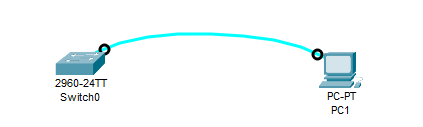
##### b.	Установите консольное подключение к коммутатору с компьютера PC-A с помощью Tera Term или другой программы эмуляции терминала.
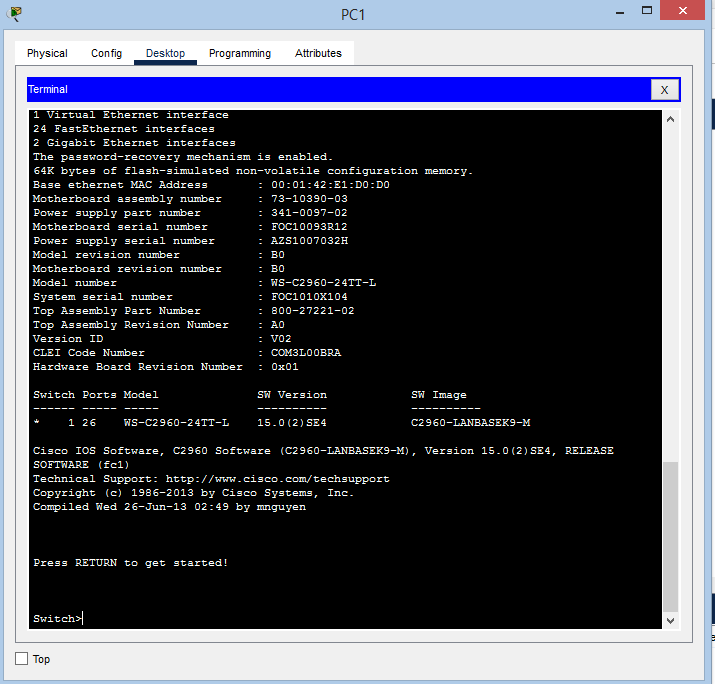  

Почему нужно использовать консольное подключение для первоначальной настройки коммутатора? Почему нельзя подключиться к коммутатору через Telnet или SSH?  

**Ответ:** Потому что для подключения через telnet или SSH нужно предварительно настроить линии виртуального терминала (VTY).  

#### Шаг 2. Проверьте настройки коммутатора по умолчанию.  

a.	Предположим, что коммутатор не имеет файла конфигурации, сохраненного в энергонезависимой памяти (NVRAM). Консольное подключение к коммутатору с помощью Tera Term или другой программы эмуляции терминала предоставит доступ к командной строке пользовательского режима EXEC в виде Switch>. Введите команду enable, чтобы войти в привилегированный режим EXEC.  
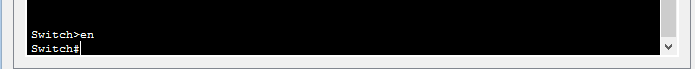  

Убедитесь, что на коммутаторе находится пустой файл конфигурации по умолчанию, с помощью команды show running-config привилегированного режима EXEC.  
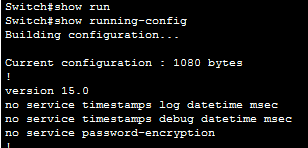  
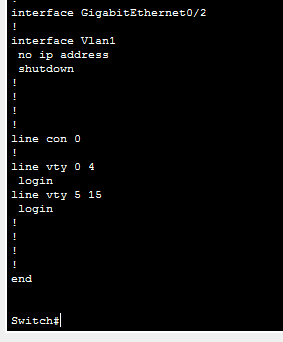  
b.	Изучите текущий файл running configuration.  

Вопросы:  

Сколько интерфейсов FastEthernet имеется на коммутаторе 2960? **Ответ:** 24  

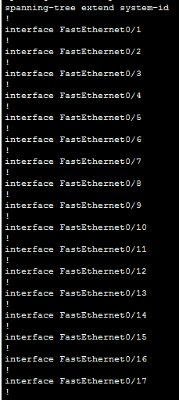  
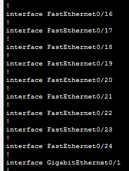  
Сколько интерфейсов Gigabit Ethernet имеется на коммутаторе 2960? **Ответ:** 2  
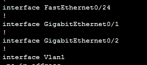  
Каков диапазон значений, отображаемых в vty-линиях? **Ответ:** 16  
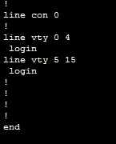  
c.	Изучите файл загрузочной конфигурации (startup configuration), который содержится в энергонезависимом ОЗУ (NVRAM).  
Вопрос: Почему появляется это сообщение?  

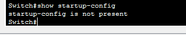  
команда **show startup-config** показывает   
**startup-config is not present**  
Это означает, что в коммутаторе еще ни разу не сохранялась конфигурация.  

d.	Изучите характеристики SVI для VLAN 1.
Вопросы:
Назначен ли IP-адрес сети VLAN 1? Не назначен
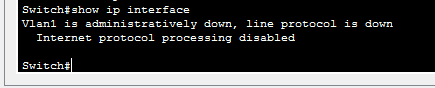  

f.	Подсоедините кабель Ethernet компьютера PC-A к порту 6 на коммутаторе и изучите IP-свойства интерфейса SVI сети VLAN 1.  
Дождитесь согласования параметров скорости и дуплекса между коммутатором и ПК.  
Выходные данные вы видите?  

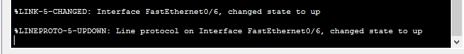  

g.	Изучите сведения о версии ОС Cisco IOS на коммутаторе.
Вопросы:
Под управлением какой версии ОС Cisco IOS работает коммутатор? 15.0(2)SE4  

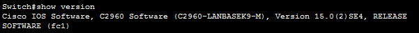  
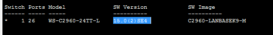  
Как называется файл образа системы? bin-файлом  

h.	Изучите свойства по умолчанию интерфейса FastEthernet, который используется компьютером PC-A.
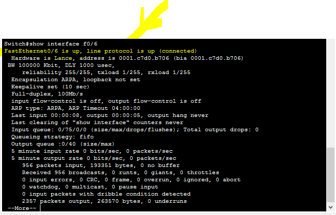  
Интерфейс поднят  
FastEthernet0/6 is up, line protocol is up (connected)  

i.	Изучите флеш-память.  
Выполните одну из следующих команд, чтобы изучить содержимое флеш-каталога.  
Switch# show flash  
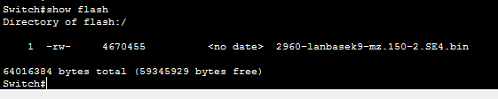  
Имя файла с операционной системой  
2960-lanbasek9-mz.150-2.SE4.bin  

### Часть 2. Настройка базовых параметров сетевых устройств  
Во второй части необходимо будет настроить основные параметры коммутатора и компьютера.  
#### Шаг 1. Настройте базовые параметры коммутатора.  
a.	В режиме глобальной конфигурации скопируйте следующие базовые параметры конфигурации и вставьте их в файл на коммутаторе S1.  

no ip domain-lookup  
hostname S1  
service password-encryption  
enable secret class  
banner motd #  
Unauthorized access is strictly prohibited. #  
  

