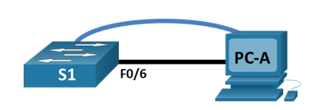

# Лабораторная работа. Базовая настройка коммутатора 

## Топология

## Таблица адресации

Устройство    | Интерфейс     | IP-адрес / префикс
------------- | ------------- | ------------- 
S1            | VLAN 1        | 192.168.1.2-255
PC-A          | NIC           | 192.168.1.10-255

## Задачи
### Часть 1. Проверка конфигурации коммутатора по умолчанию
### Часть 2. Создание сети и настройка основных параметров устройства
#### •	Настройте базовые параметры коммутатора.
#### •	Настройте IP-адрес для ПК.
### Часть 3. Проверка сетевых подключений
#### •	Отобразите конфигурацию устройства.
#### •	Протестируйте сквозное соединение, отправив эхо-запрос.
#### •	Протестируйте возможности удаленного управления с помощью Telnet.
